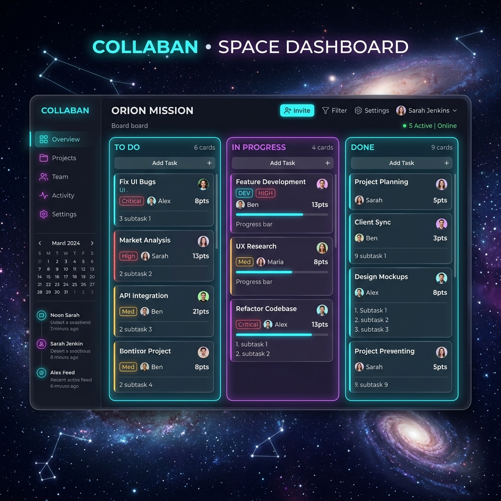
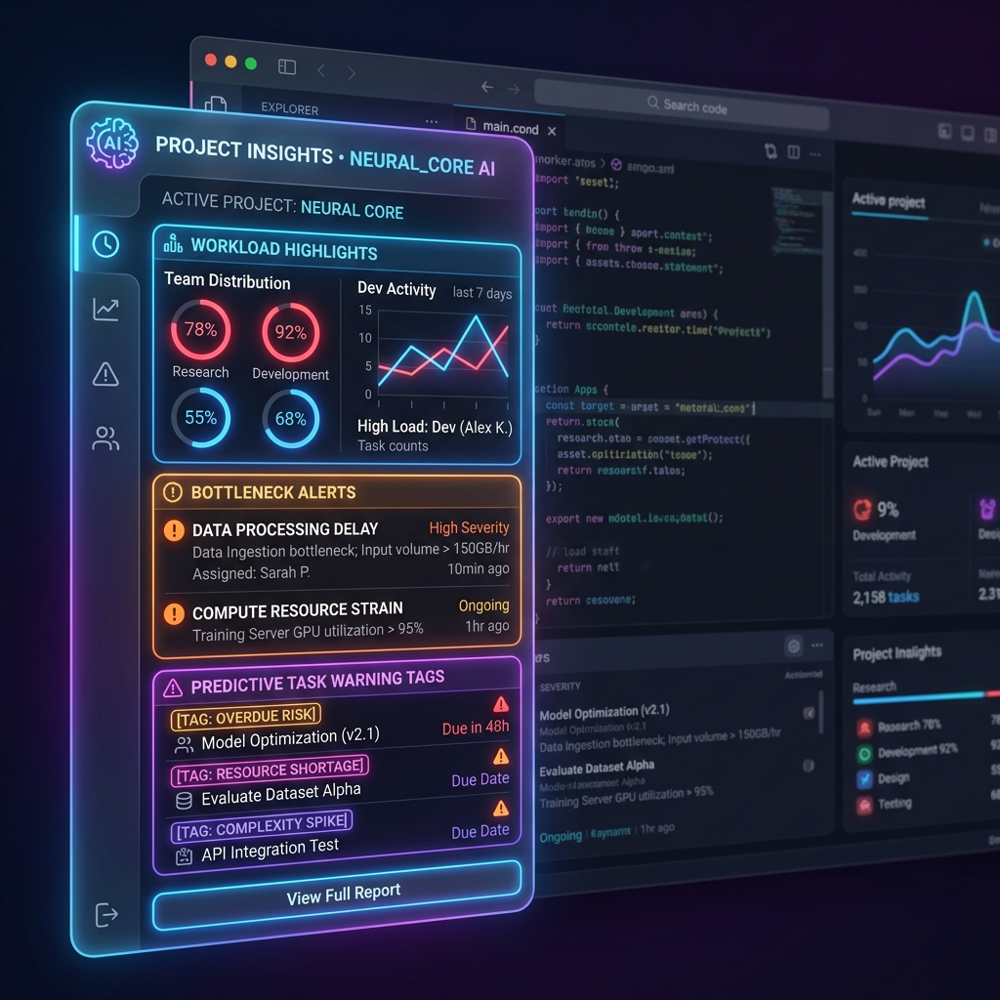
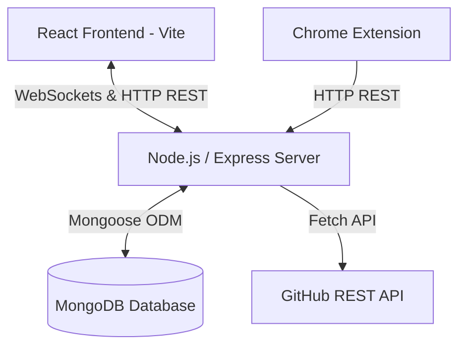
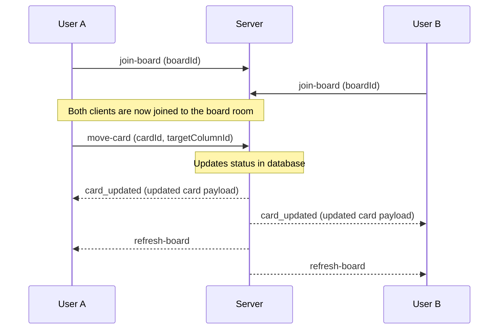

# Syncpad: Real-Time Collaborative Kanban Board with AI Project Manager

Syncpad is a modern, real-time collaborative Kanban board application designed to keep software teams perfectly in sync. It features custom glassmorphic aesthetics, automated AI project management analysis, a Chrome Extension helper for clipping tasks directly from the browser, and deep integration with GitHub issues.

## 🚀 Key Features

*   **Real-time Collaboration**: Instant synchronization of card movements, creation, edits, and deletions across all connected clients via WebSockets (Socket.io).
*   **AI Project Manager**: An integrated analytics engine that automatically detects workflow bottlenecks, evaluates sprint completion risks, and infers task complexity.
*   **GitHub Integration**: Fetch and paginated import of public GitHub issues directly into the board, excluding pull requests and preventing duplicate imports.
*   **Chrome Extension**: A Manifest V3 utility to clip webpage contents, auto-extract text selections, and push them as tasks to specific board columns.
*   **Futuristic Design**: A premium glassmorphic UI utilizing deep space backdrops, dark-mode gradients, and smooth state transition micro-animations.

---

## 📸 Application Mockups

### 1. Main Kanban Dashboard
A sleek interface with visual columns, card metadata indicators, drag-and-drop mechanics, and GitHub integration triggers.


### 2. AI Project Manager Insights
Deep analytical review featuring bottleneck alerts, velocity calculation metrics, complexity discrepency warnings, and timeline risk states.


---

## 🏗️ System Architecture

Syncpad is structured as a fullstack monorepo containing three core components:



### Component Details
1.  **Frontend Client (`/frontend`)**: A React SPA powered by Vite, featuring a drag-and-drop board built with `@dnd-kit/core`, Bootstrap grid frameworks, and Lucide icons.
2.  **Backend Server (`/backend`)**: An Express.js REST API and Socket.IO server running on Node.js. It manages the business logic, handles WebSocket events, runs background AI sweeps, and interfaces with MongoDB.
3.  **Chrome Extension (`/extension`)**: A Manifest V3 vanilla JavaScript extension that extracts tab metadata and text selections to push clipped content directly to the backend REST API.

---

## 🔌 WebSocket Design

Real-time coordination is built on Socket.IO rooms. Each board acts as a distinct workspace, isolating socket events by `boardId`.



### Event Registry

#### Client-to-Server
*   `join-board (boardId)`: Assigns the socket client to the room designated for `boardId`.
*   `move-card ({ boardId, cardId, targetColumnId })`: Initiates status transitions. The server persists the update and broadcasts confirmations.
*   `card_created (card)`: Broadcasts newly added card payloads to other room members.
*   `card_updated (card)`: Broadcasts manual card edits to other room members.
*   `card_deleted ({ cardId, boardId })`: Broadcasts card removal indices to other room members.
*   `notify-board-change (boardId)`: Forces all clients in the room to trigger a silent board data refetch.

#### Server-to-Client
*   `card_created (card)`: Adds the new card payload to the local React state.
*   `card_updated (card)`: Modifies or updates properties of the matching card in React state.
*   `card_deleted (cardId)`: Removes the deleted card from the React canvas.
*   `refresh-board`: Triggers a background HTTP GET fetch to pull the absolute source of truth.
*   `ai-progress ({ step, percent, message })`: Transmits real-time progress steps during AI analysis execution (streams load, analysis, evaluation, and completion states).
*   `ai-insights (insights)`: Broadcasts the completed analysis payload to the frontend.

---

## ⚖️ Conflict Handling

To ensure high-responsiveness and strict consistency across multiple concurrent sessions, Syncpad implements a hybrid strategy combining **Optimistic Updates** with **Deterministic Lockstep Resolution**:

1.  **Optimistic UI Rendering**:
    When a user drags a card, the frontend immediately reorders the React state locally before the network roundtrip completes. This guarantees instant visual feedback without latency.
2.  **Atomic Database Persistence**:
    The card status update is sent to the server as a single atomic write operations (`findById` followed by `.save()`).
3.  **Broadcast Convergence**:
    Upon saving, the server emits `card_updated` and `refresh-board` to all clients in the room. If Client B had moved the same card concurrently, whichever request reached the server first is written. The subsequent socket broadcasts force both clients' states to align with the server's final state, preventing desynchronized canvas structures.
4.  **Complete Sync Fallback**:
    If any websocket communication drops or local UI states drift, the client captures the `refresh-board` event and initiates a background HTTP fetch to pull the entire board structure from MongoDB, resetting the local canvas to match the database exactly.

---

## 🤖 AI Project Manager Methodology

The AI engine runs at server startup, periodically every 6 hours, and can be manually triggered via a dashboard action. It performs three analytical phases:

### 1. Complexity Inference Heuristics
When a card has no user-defined complexity, or is newly added, the engine scans the title and description against pre-defined keyword weight maps:
*   **High Complexity (Score 5)**: Keywords like `auth`, `security`, `oauth`, `database`, `schema`, `deploy`, `real-time`, `websocket`, `algorithm`, `sync`, etc.
*   **Medium Complexity (Score 3)**: Keywords like `ui`, `style`, `component`, `layout`, `test`, `logic`, `validation`, `form`.
*   **Low Complexity (Score 1)**: Keywords like `fix`, `typo`, `doc`, `text`, `label`, `button`, `color`.
*   **Default Score (Score 2)**: Fallback applied when no indicators match.
*   *Discrepancy Warning*: If the user manually inputs a score that differs from the inferred score by $\ge 2$ units, the AI flags a discrepancy (e.g. marking a task containing "optimize authentication schema" as a complexity score of 1).

### 2. Bottleneck Capacity Monitoring
The engine compares the current card distribution in columns against established agile capacity ratios:
*   **In-Progress Congestion (High Severity)**: Triggered if `In Progress` has $> 3$ tasks. Warns that the team is spread too thin.
*   **To-Do Backlog Heap (Medium Severity)**: Triggered if `To Do` holds $> 60\%$ of total board tasks (where total tasks $> 5$). Suggests backlog grooming.

### 3. Predictive Velocity & Sprint Risk Simulation
The system tracks completion rates over time to predict timeline feasibility:
$$\text{Velocity} = \frac{\text{Done Cards}}{\text{Days Elapsed since Board Creation}}$$
$$\text{Remaining Days} = \text{Sprint End Date} - \text{Current Date}$$
$$\text{Days Required} = \frac{\text{Uncompleted Cards}}{\text{Velocity}}$$

Based on this calculation, risk levels are evaluated as:
*   **Critical**: Deadline passed with uncompleted cards, or $\text{Days Required} > \text{Remaining Days} \times 1.5$.
*   **High**: Completion requires slightly more time than remaining ($\text{Days Required} > \text{Remaining Days}$).
*   **Medium**: Timeline is tight ($\text{Days Required} > \text{Remaining Days} \times 0.75$).
*   **Low**: Target dates align with estimated work velocity.

---

## 🐙 GitHub API Pagination Handling

The GitHub importer maps public issues to Kanban cards. To prevent rate-limiting and browser freeze when querying repositories with hundreds of issues, Syncpad employs a paginated fetching strategy:

1.  **Paginated Retrieval**: The backend requests exactly 10 issues per page:
    `GET https://api.github.com/repos/{owner}/{repo}/issues?state=open&page={page}&per_page=10`
2.  **Pull Request Filtering**: GitHub's issues endpoint returns both issues and pull requests. The backend explicitly filters out elements containing the `pull_request` key.
3.  **Duplicate Import Mitigation**:
    *   Cards in MongoDB record their origin using a `githubIssueId` field.
    *   Before rendering the search preview, the backend performs a batch lookup:
        `Card.find({ boardId, githubIssueId: { $in: fetchedIds } })`
    *   Issues already in the database are flagged as `alreadyImported: true`.
4.  **Stateless UI Pagination**:
    *   The frontend displays the current page number and controls.
    *   The "Next" button is enabled only if the backend returns `hasMore: true` (which is true if exactly 10 items were returned by GitHub).
    *   Checking "Select All" selects only the unimported issues of the current active page, keeping payloads small and actions explicit.

---

## 🛠️ Environment Variables

### Backend Config (`/backend/.env`)
Create a `.env` file inside the `backend` folder:
```env
PORT=5000
MONGODB_URI=mongodb+srv://<user>:<password>@cluster.mongodb.net/syncpad
FRONTEND_URL=http://localhost:5173
```
*Note: If `MONGODB_URI` is omitted or unavailable, the backend automatically spins up an in-memory database server for developer convenience.*

### Frontend Config (`/frontend/.env`)
Create a `.env` file inside the `frontend` folder:
```env
VITE_BACKEND_URL=http://localhost:5000
```
*Note: In production deployments, if the frontend is hosted from the same domain as the backend server (unified hosting), `VITE_BACKEND_URL` can be left blank.*

---

## 💻 Local Testing & Run Instructions

### 1. Installation
Install all root, backend, frontend, and development dependencies using the unified installer:
```bash
npm run install:all
```

### 2. Run Development Servers
Launch both servers concurrently:
```bash
npm run dev
```
*   **Frontend**: [http://localhost:5173](http://localhost:5173)
*   **Backend**: [http://localhost:5000](http://localhost:5000)

### 3. Verify Static Assets Build
Compile production-ready React client assets:
```bash
npm run build
```
This outputs assets to `frontend/dist`. You can preview the compiled build locally using:
```bash
npm run start
```
This runs the Express server on [http://localhost:5000](http://localhost:5000) which will host the static assets directly.

### 4. Running Tests
You can run standard tests using the packages configured in each subdirectory. To check styles and run lint checks:
*   Frontend Linting: `npm run lint --prefix frontend`

---

## ☁️ Railway Deployment Instructions

Syncpad is pre-configured for instant deployment on [Railway](https://railway.app) using a unified single-service container deployment, or as two decoupled services.

### Option A: Unified Deployment (Recommended)
Deploying as a single Node.js service is the most cost-efficient method because the backend serves the frontend build statically:

1.  **Fork/Push to GitHub**: Push the repository to your GitHub account.
2.  **Create Railway Project**:
    *   Log in to Railway and click **New Project** -> **Deploy from GitHub repo**.
    *   Select your pushed repository.
3.  **Configure Variables**:
    Under the **Variables** tab of the service, add:
    *   `PORT`: `5000` (or leave blank; Railway auto-binds)
    *   `MONGODB_URI`: Your MongoDB Atlas Connection String.
    *   `NODE_ENV`: `production`
4.  **Automatic Build**:
    Railway will automatically detect the root `package.json` scripts:
    *   It executes `npm run build` (which triggers `npm run build:frontend` to output to `frontend/dist`).
    *   It starts the application with `npm run start` (which runs `node backend/server.js`).
5.  **Expose Domain**:
    Under the **Settings** tab, click **Generate Domain**. Your board and API are now accessible on the same public address!

---

### Option B: Decoupled Deployment
If you want to host the frontend (e.g. Netlify/Vercel) and the backend (Railway) separately:

#### 1. Backend Service (Railway)
*   Deploy the repository and configure the Root Directory setting to `backend`.
*   Set the start command to `npm start`.
*   Provide variables:
    *   `MONGODB_URI`: Your MongoDB database connection string.
    *   `FRONTEND_URL`: The URL of your separately hosted frontend.

#### 2. Frontend Service
*   Deploy the repository and set the Root Directory to `frontend`.
*   Configure the build command to `npm run build` and output directory to `dist`.
*   Add environment variable:
    *   `VITE_BACKEND_URL`: The URL of your deployed Railway backend.

---

### 🔌 Chrome Extension Configuration
Once deployed, update the `BACKEND_URL` in `extension/popup.js` to point to your live backend domain:
```javascript
// Change from:
const BACKEND_URL = 'http://localhost:5000';
// Change to:
const BACKEND_URL = 'https://your-production-app.up.railway.app';
```
Reload the extension in `chrome://extensions` to apply changes.
